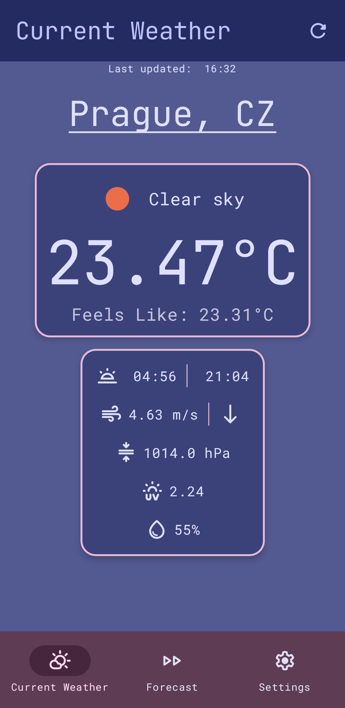
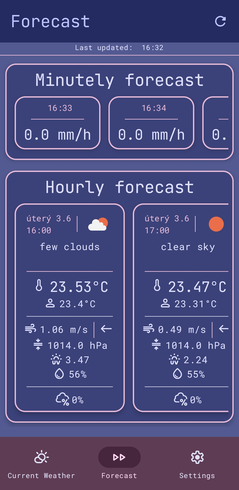
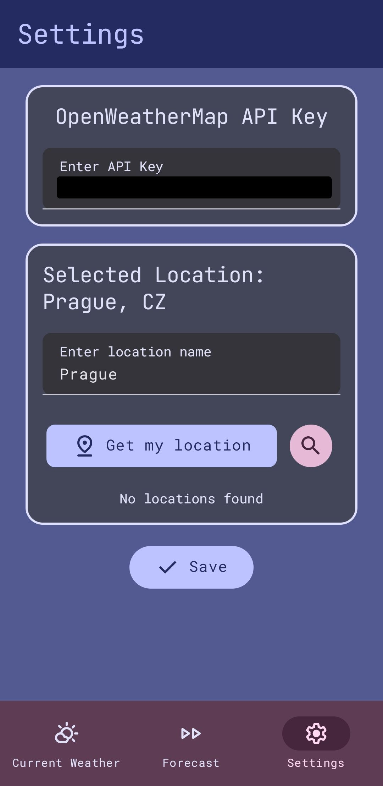

# Android Weather App

A simple Android weather app that provides current weather information and forecasts using the OpenWeatherMap API.

## Features
- Current weather conditions
- Minute-by-minute precipitation forecast
- Hourly weather forecast
- 7-day weather forecast
- Location selection via your location or manual input

## Usage
You need to supply your API key and desired location
 1. Open settings
 2. Enter your OpenWeatherMap API key (docs [here](https://openweathermap.org/api))
 3. Search for your desired location (click on magnifying glass icon)
 4. Select the right one in search results (click on list icon below)
 5. Save

You can also use your location instead of searching.

## Implementation
- Uses Jetpack Compose for UI
- The app uses the OpenWeatherMap API to fetch weather data.
- Fetched data is stored in a local database using Room.
- If the fetched data is older than 10 minutes, it is refreshed.
- Settings are managed using DataStore.
- Optional location permissions for automatic location detection.

## Screenshots

## Attributions
[Uv index icons created by Icon Mart - Flaticon](https://www.flaticon.com/free-icons/uv-index)
